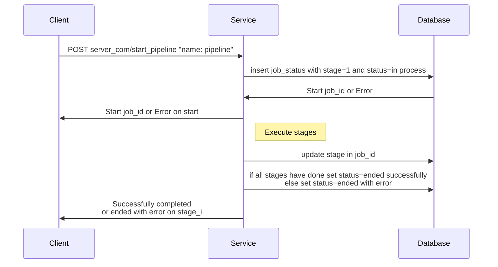

Для создания pipeline отправляется HTTP POST-запрос на server.com/create_pipeline с данными в формате json следующего вида:
```json
{
    "pipeline_name": <имя pipeline>,
    "stages": <перечисление каждой стадии с их порядковыми номерами с описанием каждой из них в формате json>
}
```

Каждая стадия pipeline также описывается в формате json и имеют следующий вид:
```json
<порядковый номер стадии в конкретном pipeline>:
    {
        "stage_type": <тип сервиса, который вызывается данной стадией, например, http. Возможные варианты типов описаны ниже>,
        "stage_params": <параметры, передающиеся в стадию, в формате json>
    }
```

В качестве параметров стадии могут выступать, например, параметры пути в HTTP запросе, передаваемые данные, возвращаемые значения, возможность передачи выходных параметров в следующую стадию и т.д.

По итогам создания pipeline сервер возвращает сообщение об успешном создании pipeline или ошибку, возникшую при его создании.

Для запуска pipeline отправляется HTTP POST-запрос на server.com/start_pipeline с заголовком вида "name: <имя pipeline>" и данными, необходимыми для работы сервиса. Сервер возвращает идентификатор начавшейся job.

Чтобы узнать текущую стадию job отправляется HTTP GET-запрос на server.com/status_job?job_id=<идентификатор>.

Структура базы данных, обслуживающей работу с pipeline представлена ниже:


В качестве примера работы с данным сервисом приведем пример pipeline, позволяющий создать пользователя в базе данных, а затем получнием jwt для дальнейшей авторизации:

Сначала создадим описанный pipeline. Для этого отправляем HTTP POST-запрос на server.com/create_pipeline с данными:
```json
{
    "pipeline_name": "Authorization",
    "stages": 
        {
            "1":
                {
                    "stage_type": "HTTP",
                    "stage_params": 
                        {
                            "url_path": "server.com/users",
                            "data": ["login", "password"],
                            "return_value": "user_id",
                            "return_codes": [200, 400],
                            "transfer_return_value_to_next_stage": true
                        }
                },
            "2":
                {
                    "stage_type": "HTTP",
                    "stage_params": 
                        {
                            "url_path": "server.com/auth",
                            "data": "user_id",
                            "return_value": "jwt",
                            "return_codes": [200, 400]
                        }
                }
        }
}
```

Для запуска данного pipeline необходимо отправить HTTP POST-запрос на server.com/start_pipeline с заголовком "name: Authorization" с данными "login: user, password: 123".
